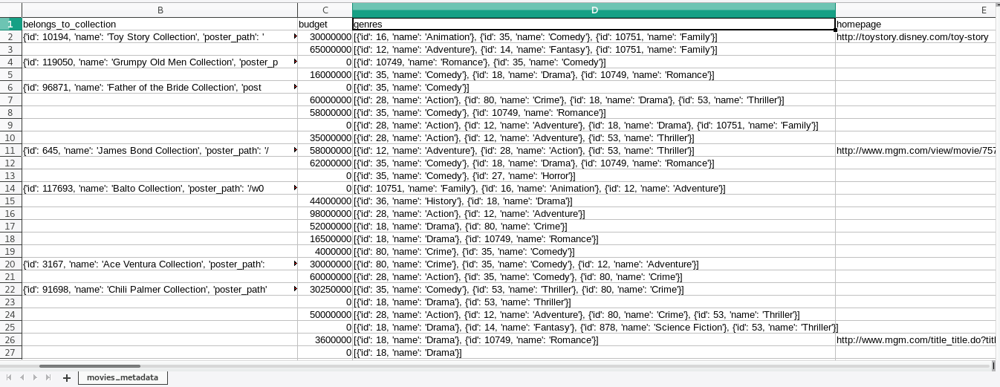
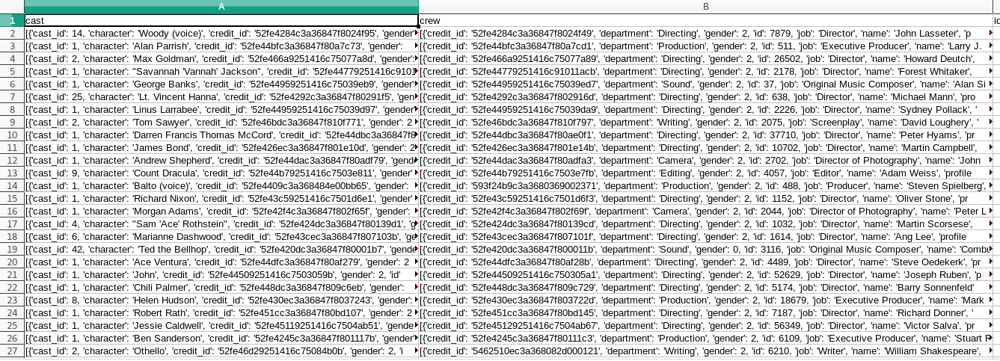
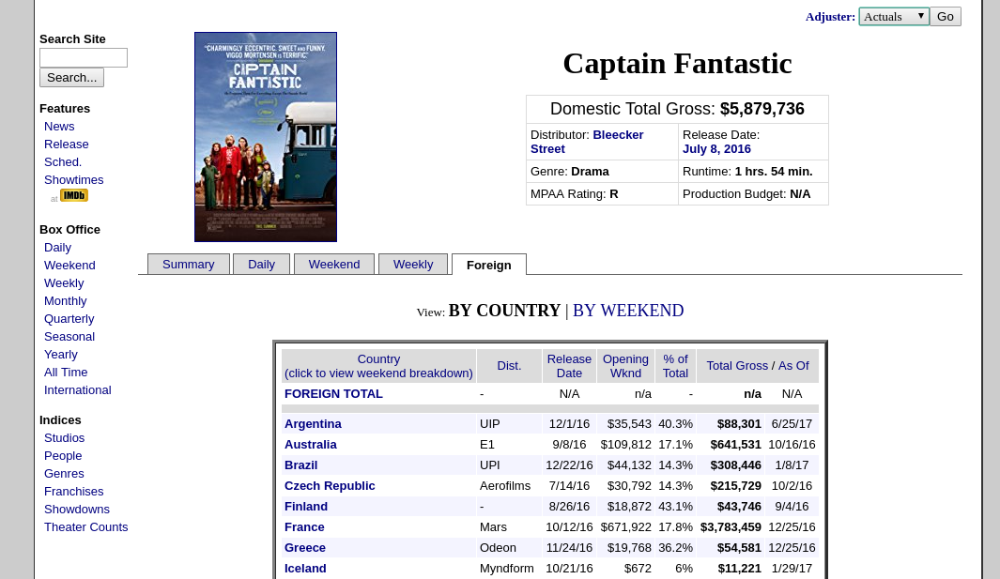
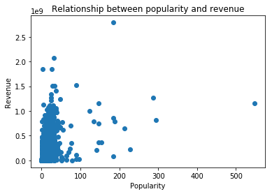
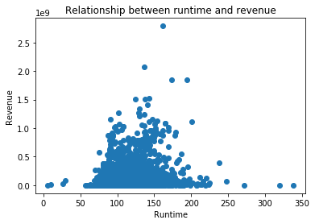
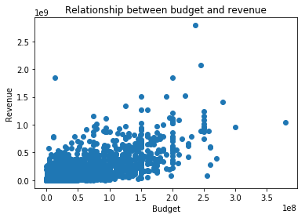
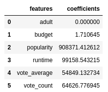

@title[Introduction]
<h2>Movie Analytics</h2>

Felipe Urra - M.Sc. Computer Science
University of Western Ontario

---
@title[The problem]
<h3>The Problem</h3>

The global film industry is huge.

Some statistics:

* USA is the third largest market in the world (behind China and India)
* About 5800 cinemas in the US as of 2016 
* Global box office is forecast to generate 50 billion dollars in 2020

Source:
https://www.statista.com/topics/964/film/

---
@title[The problem]
<h3>The Problem</h3>

To predict revenue could be very substantial for movie studios:

* Budget
* Marketing
* Crew

---
@title[The data]
<h3>The data</h3>

-TMDB

---
@title[The data]
<h3>The data</h3>
 

---
@title[The data]
<h3>The data</h3>
 

---
@title[The data problem?]
<h3>Data problems</h3>
Missing values:

* Revenue: ~7k of 45k
* Budget: ~2k of 7k

---
@title[Scraping]
<h3>Scraping</h3>

---
@title[Join data and Encoding]
<h3>Join data and Encoding</h3>

* One hot encoding
* Memory issues
---
@title[Join data and Encoding]
<h3>Join data and Encoding</h3>

Too many features:

* cast: 6524
* directors: 4752
* languages: 42
* collection: 655
* writers: 5133
* genres: 20
* producers: 3858
* spoken languages: 94
---
@title[Basic analysis]
<h3>Popularity VS Revenue</h3>

---
@title[Basic analysis]
<h3>Runtime VS Revenue</h3>

---
@title[Basic analysis]
<h3>Budget VS Revenue</h3>

---
@title[Model analysis]
<h3>Linear coefficients</h3>

Mean Square Error = 8110663175083914.0
---
@title[Model analysis]
<h3>Linear coefficients + genre features</h3>

Mean Square Error = 7620100426286874.0
---
@title[Model analysis]
<h3>Linear coefficients + genres + collection features</h3>

Mean Square Error = 4685249279116433.0
---
@title[Upcoming tasks]
<h3>Upcoming tasks</h3>

* Define set of features
* Use test and validation data
* Use Linear Regression
---
@title[Pending tasks]
<h3>Pending tasks</h3>

* Memory issues
* Nonlinear models
---
@title[End]
<h3>Thanks</h3>
Questions? Suggestions?