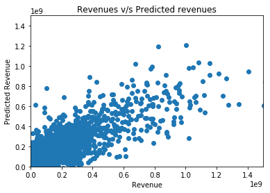
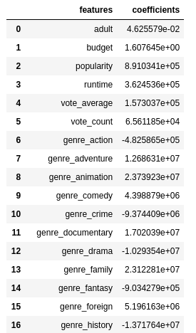
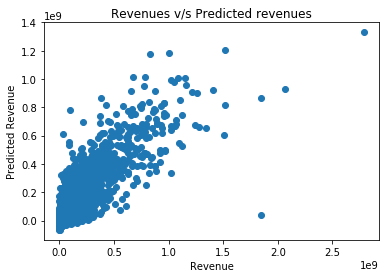
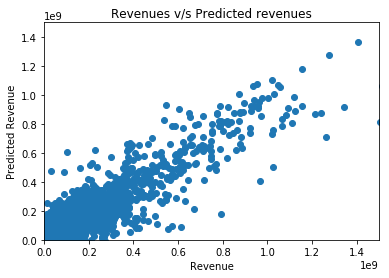

@title[Introduction]
<h2>Movie Analytics</h2>

Felipe Urra - M.Sc. Computer Science

University of Western Ontario

---
@title[The problem]
<h3>The Problem</h3>

The global film industry is huge.

Some statistics:

* China, India and USA are the three largest markets in the world
* About 5800 cinemas in the US as of 2016 
* Global box office is forecast to generate 50 billion dollars in 2020

Source:
https://www.statista.com/topics/964/film/

---
@title[The problem]
<h3>The Problem</h3>

Revenue prediction is an important problem in the movie industry.

To predict revenue could be very substantial for movie studios:

* Budget
* Marketing
* Crew
* $$$$

---
@title[The solution]
<h3>The solution(?)</h3>

Use regression over a given set of features.

* Get data
* Preprocess data
* Learn from data
* ????
* Profit

---
@title[The data]
<h3>The data</h3>

-TMDB

---
@title[The data]
<h3>Metadata</h3>
 

---
@title[The data]
<h3>Credits</h3>
 

---
@title[Data problems]
<h3>Data problems</h3>
Missing values:

* Revenue: ~7k of 45k
* Budget: ~2k of 7k

---
@title[Scraping]
<h3>Scraping</h3>

---
@title[Join data and Encoding]
<h3>Join data </h3>

* No common id between TMDB and BOM.

Idea: Separate regions for revenue

* Countries or regions (almost continents)
* Even less data
---
@title[The data]
<h3>Features:</h3>

* budget
* popularity
* revenue
* runtime
* vote_average
* vote_count
* language
---
@title[The data]
<h3>Features (cont):</h3>

* cast
* directors
* writers
* producers
* production_companies
* genres
* spoken_languages
* collection (franchise)
---
@title[Encoding]
<h3>Encoding</h3>

Too many features:

* cast: 6524
* directors: 4752
* languages: 42
* collection: 655
* writers: 5133
* genres: 20
* producers: 3858
* spoken languages: 94
---
@title[Basic analysis]
<h3>Popularity VS Revenue</h3>

---
@title[Basic analysis]
<h3>Runtime VS Revenue</h3>

---
@title[Basic analysis]
<h3>Budget VS Revenue</h3>

---
@title[Model analysis]
<h3>Linear coefficients</h3>

Mean Square Error = 8110663175083914.0
---
@title[Model analysis]
<h3>Predicting values</h3>

Mean Square Error = 8110663175083914.0
---
@title[Model analysis]
<h3>Movies + genre features</h3>

---
@title[Model analysis]
<h3>Movies + genre features</h3>

Mean Square Error = 7620100426286874.0
---
@title[Model analysis]
<h3>Movies + genres + collection features</h3>

Mean Square Error = 4685249279116433.0
---
@title[Upcoming tasks]
<h3>Upcoming tasks</h3>

* Define final set of features
* Use test and validation data
* Apply Linear Regression
---
@title[Pending tasks]
<h3>Pending tasks</h3>

* Memory issues
* Nonlinear models
---
@title[End]
<h3>Thanks</h3>
Questions? Suggestions?